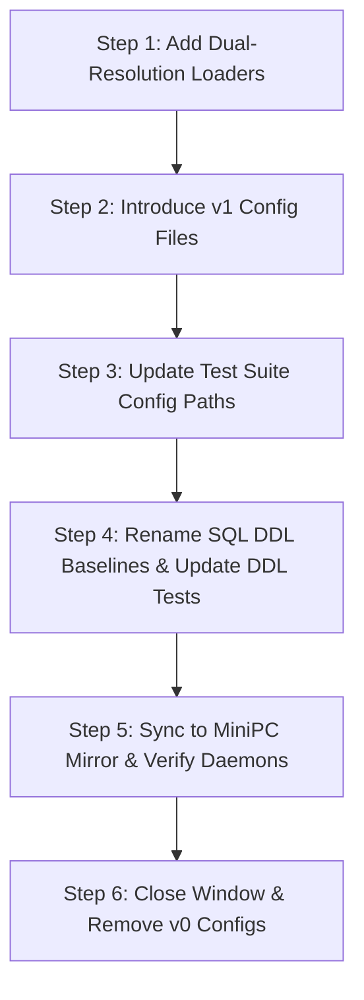

# DP-106 — Migration strategy from v0 schema/config names

Status: DONE
Milestone: M1  
Depends on: DP-101..DP-105

## Problem

Production-shaped code still carries `poc`, `schema.v0.sql`, and mixed v0/v1 config names.
A rename done too early risks churn; leaving them forever makes stable releases confusing.

## Outcome

Plan and execute a compatibility-preserving transition to stable package/schema/config
naming only after M1 contracts are settled.

## Acceptance criteria

- no big-bang database rebuild;
- ordered migrations remain replayable;
- Python import/CLI compatibility strategy is explicit;
- deploy/systemd paths are updated atomically where needed;
- MiniPC proof covers upgrade from current production baseline;
- no rename is coupled to brand clearance unless technically necessary.

## 1. Scope and Non-Goals

### Scope
- **Live configuration artifacts**: Transition strategy for `config/source-registry.v0.json` and `config/transcription-policy.v0.json` to stable v1 naming (`config/source-registry.v1.json` and `config/transcription-policy.v1.json`), aligning with the existing `config/claim-extraction.v1.json`.
- **DDL baseline artifacts**: Transition strategy for `db/schema.v0.sql` and `db/job_queue.v0.sql` to versioned baselines (`db/schema.v1.sql` and `db/job_queue.v1.sql`) alongside tests and documentation.
- **Runtime fallback adapters**: Dual-resolution loader logic in `poc/dichiarazioni_pubbliche/source_watcher.py`, `poc/dichiarazioni_pubbliche/scheduler_daemon.py`, and `poc/dichiarazioni_pubbliche/asr_router.py` ensuring zero downtime during file synchronization.
- **MiniPC mirror deployment safety**: Synchronizing changes to `/home/udodo/src/DichiarazioniPubbliche.it` (which is a synced tree, **not a git checkout**) without crashing systemd services or timers.

### Non-Goals
- **No database identifier renames**: PostgreSQL catalog objects (tables, columns, indexes, constraints, views, enum types) contain zero `v0` strings. No database identifier changes or table rebuilds will be performed.
- **No package rename in this ticket**: Renaming `poc/` and `dichiarazioni_pubbliche` is explicitly deferred to post-M1 freeze and governed by ticket DP-601.
- **No rewriting of immutable history**: Historical documentation (`docs/*-v0.md`), research benchmark receipts (`research/results/poc-benchmark-v0.json`), archived UI prototypes (`prototypes/ux-v0/`), and immutable migration headers (`db/migrations/*.sql`) are historical records and remain verbatim.
- **No premature brand cutover**: Technical identifier cleanup is strictly decoupled from commercial brand clearance and domain registration (owned by DP-701).
- **No code modifications executed by this ticket**: This ticket specifies the strategy and contract; execution is performed by dedicated implementation tasks.

## 2. Classification Table

### Live Artifacts (Require Migration with Compatibility Window)

| Artifact Path | Kind | Risk Level | Live Runtime Consumers | Test / Tooling Consumers | Proposed Action & Target |
|---|---|---|---|---|---|
| `config/source-registry.v0.json` | Runtime Configuration | **HIGH** | `source_watcher.py` (`DEFAULT_REGISTRY`), `scheduler_daemon.py` (`main()` fallback), `deploy/systemd/dichiarazioni-pubbliche-source-poll.service`, `deploy/systemd/dichiarazioni-pubbliche-source-poll-daily.service` | `tests/test_runtime_policy.py`, `tests/test_source_adapters.py` | Add fallback loader in runtime; introduce `config/source-registry.v1.json`; migrate callers; retain v0 during compatibility window. |
| `config/transcription-policy.v0.json` | Runtime Configuration | **HIGH** | `asr_router.py` (`DEFAULT_POLICY`), `worker_daemon.py` (transitive consumer via `plan_asr()`) | `tests/test_runtime_policy.py` | Add fallback loader in runtime; introduce `config/transcription-policy.v1.json`; retain internal `"name": "transcription-policy-v0"` until window closure. |
| `db/schema.v0.sql` | SQL DDL Baseline | **LOW** | None (PostgreSQL runtime uses migrated schema; daemons do not load DDL at runtime) | `tests/test_schema_contract.py`, `tests/test_speaker_runtime.py`, `tests/test_scheduler_daemon.py` | Rename to `db/schema.v1.sql`; update test paths and `AGENTS.md`. No database tables affected. |
| `db/job_queue.v0.sql` | SQL DDL Baseline | **LOW** | None (PostgreSQL runtime holds queue tables; daemons execute SQL queries via `queue_runtime.py`) | `tests/test_job_queue_sql.py` | Rename to `db/job_queue.v1.sql`; update test paths. No queue tables affected. |
| `poc/dichiarazioni_pubbliche` | Python Package Directory | **HIGH** | All systemd units (`dichiarazioni-pubbliche-worker.service`, `dichiarazioni-pubbliche-source-poll.service`, `dichiarazioni-pubbliche-source-poll-daily.service`, `dichiarazioni-pubbliche-health.service`), all runtime modules | All test suites (`tests/`), `pyproject.toml` | **DEFERRED** until M1 contracts freeze; specified in Section 5 and implemented under DP-601. |

### Documentation-Only & Historical Artifacts (Retain Verbatim as Immutable History)

| Artifact Path | Kind | Risk Level | Consumers | Policy & Rationale |
|---|---|---|---|---|
| `docs/15-poc-benchmark-v0.md` | Historical Design Doc | None | Reference only | Immutable historical benchmark design and publication gate receipt. Retain verbatim. |
| `docs/20-canonical-transcript-and-postgres-v0.md` | Historical Architecture Doc | None | Reference only | Architectural record of initial canonical transcript and schema decisions. Retain verbatim. |
| `docs/21-brand-naming-v0.md` | Historical Brand Doc | None | Reference only | Brand exploration notes for Dichiarazioni Pubbliche working brand. Retain verbatim. |
| `docs/24-processing-worker-costs-and-health-v0.md` | Historical Operations Doc | None | Reference only | Operational baseline receipt for worker daemon and health digests. Retain verbatim. |
| `docs/tickets/DP-106-v0-name-migration-strategy.md` | Migration Strategy Ticket | None | Implementers | This strategy document itself; retains ticket identity. |
| `research/results/poc-benchmark-v0.json` | Research Receipt | None | Historical receipts (`DP-603`, `DP-604`) | Offline benchmark evaluation artifact from 2026-09-21; not loaded by tests or daemons. Retain verbatim. |
| `prototypes/ux-v0/` | Static Web Prototypes | None | Browser prototypes | Static HTML exploratory prototypes (`editorial.html`, `evidence-graph.html`, `media-timeline.html`). Archive only; retain verbatim. |
| `db/migrations/20260925-add-role-interval-organizations.sql` | Applied SQL Migration | None | PostgreSQL migration replay | Contains a comment referencing `schema.v0.sql`. Applied migrations are immutable append-only records; do not edit historical comments. |

## 3. Compatibility Window Policy

### 3.1 Two-Phase Dual-Resolution Loading
Because the MiniPC mirror (`/home/udodo/src/DichiarazioniPubbliche.it`) is updated via file synchronization and is not an atomic git checkout, configuration files and Python code updates may arrive in non-atomic rsync passes. To prevent daemon startup failure:
1. **Candidate Precedence**: Runtime loaders (`source_watcher.load_registry()`, `scheduler_daemon.py`, `asr_router.load_policy()`) MUST check for the canonical new path first (e.g., `config/source-registry.v1.json`, `config/transcription-policy.v1.json`).
2. **Graceful Fallback**: If the new path does not exist, the loader MUST fall back to the legacy file (`config/source-registry.v0.json` or `config/transcription-policy.v0.json`) and log a diagnostic warning (`logger.info("Loaded legacy v0 config fallback: ...")`).
3. **Window Duration**: The fallback window MUST remain open for at least **one full release cycle** (or a minimum of 7 consecutive days of error-free MiniPC daemon operation).
4. **Window Closure**: Deletion of the `*.v0.json` files and removal of the fallback branching logic can only proceed after verification that zero fallback log warnings have appeared across all MiniPC systemd unit journals during the observation period.

### 3.2 Internal Policy Identity Key Stability
`config/transcription-policy.v0.json` contains the top-level property:
```json
"name": "transcription-policy-v0"
```
- **Invariance**: When creating `config/transcription-policy.v1.json`, the internal `"name"` field MUST remain `"transcription-policy-v0"` throughout the compatibility window.
- **Rationale**: Automated test fixtures, audit logs, and down-stream receipt comparators inspect or serialize policy identity. Changing the file name and the internal identifier simultaneously causes double-fault diagnostic ambiguity. The internal key may only be updated when the fallback window officially closes.

## 4. Ordered Migration Steps



### Step 1: Add Dual-Resolution Loader Fallbacks in Python Runtime
- **Precondition**: All existing tests pass on current branch (`PYTHONPATH=poc python3 -m unittest discover -s tests -v`).
- **Action**:
  1. In `poc/dichiarazioni_pubbliche/source_watcher.py`:
     - Define `PRIMARY_REGISTRY = ROOT / "config" / "source-registry.v1.json"`.
     - Define `FALLBACK_REGISTRY = ROOT / "config" / "source-registry.v0.json"`.
     - Update `load_registry(path: Path | None = None)`: if `path` is not provided, load `PRIMARY_REGISTRY` if it exists, otherwise fall back to `FALLBACK_REGISTRY`.
  2. In `poc/dichiarazioni_pubbliche/scheduler_daemon.py`:
     - Update CLI argument default resolution in `main()` to use `load_registry()`'s resolution order.
  3. In `poc/dichiarazioni_pubbliche/asr_router.py`:
     - Define `PRIMARY_POLICY = ROOT / "config" / "transcription-policy.v1.json"`.
     - Define `FALLBACK_POLICY = ROOT / "config" / "transcription-policy.v0.json"`.
     - Update `load_policy(path: Path | None = None)`: if `path` is not provided, load `PRIMARY_POLICY` if it exists, otherwise fall back to `FALLBACK_POLICY`.
- **Verification**:
  - Run `PYTHONPATH=poc python3 -m unittest discover -s tests -v` (proves that existing tests, which have not yet created `*.v1.json`, continue to pass transparently via fallback).
  - Targeted test: run `python3 -c "from dichiarazioni_pubbliche.source_watcher import load_registry; r = load_registry(); assert len(r['sources']) > 0"` and verify return code 0.
  - Targeted test: run `python3 -c "from dichiarazioni_pubbliche.asr_router import load_policy; p = load_policy(); assert p['name'] == 'transcription-policy-v0'"` and verify return code 0.
- **Rollback**: Revert edits to `source_watcher.py`, `scheduler_daemon.py`, and `asr_router.py` via git checkout.

### Step 2: Introduce `v1` Configuration Files as Validated Copies
- **Precondition**: Step 1 verified and committed.
- **Action**:
  1. Copy `config/source-registry.v0.json` to `config/source-registry.v1.json`.
  2. Copy `config/transcription-policy.v0.json` to `config/transcription-policy.v1.json`.
  3. Ensure `"name": "transcription-policy-v0"` is preserved in `config/transcription-policy.v1.json`.
- **Verification**:
  - File equality check:
    ```bash
    cmp config/source-registry.v0.json config/source-registry.v1.json
    cmp config/transcription-policy.v0.json config/transcription-policy.v1.json
    ```
  - Test primary loader selection:
    ```bash
    python3 -c "from dichiarazioni_pubbliche.source_watcher import load_registry, PRIMARY_REGISTRY; r = load_registry(); assert PRIMARY_REGISTRY.exists()"
    python3 -c "from dichiarazioni_pubbliche.asr_router import load_policy, PRIMARY_POLICY; p = load_policy(); assert PRIMARY_POLICY.exists()"
    ```
- **Rollback**: Remove `config/source-registry.v1.json` and `config/transcription-policy.v1.json`. Step 1 fallback maintains system operation.

### Step 3: Update Test Suite References to Config Files
- **Precondition**: Step 2 verified.
- **Action**:
  1. In `tests/test_runtime_policy.py`:
     - Update paths pointing to `config/transcription-policy.v0.json` -> `config/transcription-policy.v1.json`.
     - Update paths pointing to `config/source-registry.v0.json` -> `config/source-registry.v1.json`.
  2. In `tests/test_source_adapters.py`:
     - Update path pointing to `config/source-registry.v0.json` -> `config/source-registry.v1.json`.
- **Verification**:
  - Run updated test modules:
    ```bash
    PYTHONPATH=poc python3 -m unittest tests/test_runtime_policy.py tests/test_source_adapters.py -v
    ```
  - Verify full test suite passes:
    ```bash
    PYTHONPATH=poc python3 -m unittest discover -s tests -v
    ```
- **Rollback**: Revert `tests/test_runtime_policy.py` and `tests/test_source_adapters.py` via git checkout.

### Step 4: Rename SQL DDL Baseline Files and Update Test Assertions
- **Precondition**: Step 3 verified.
- **Action**:
  1. Git mv `db/schema.v0.sql` to `db/schema.v1.sql`.
  2. Git mv `db/job_queue.v0.sql` to `db/job_queue.v1.sql`.
  3. In `tests/test_schema_contract.py`:
     - Update `cls.sql = (ROOT / "db" / "schema.v0.sql").read_text()` -> `(ROOT / "db" / "schema.v1.sql").read_text()`.
  4. In `tests/test_speaker_runtime.py`:
     - Update `cls.sql = (ROOT / "db" / "schema.v0.sql").read_text()` -> `(ROOT / "db" / "schema.v1.sql").read_text()`.
  5. In `tests/test_scheduler_daemon.py`:
     - Update `schema = (root / "db/schema.v0.sql").read_text()` -> `(root / "db/schema.v1.sql").read_text()`.
  6. In `tests/test_job_queue_sql.py`:
     - Update `cls.sql = (ROOT / "db" / "job_queue.v0.sql").read_text()` -> `(ROOT / "db" / "job_queue.v1.sql").read_text()`.
  7. Update `AGENTS.md` contract reference: replace `db/schema.v0.sql` with `db/schema.v1.sql`.
  8. **Zero modifications to `db/migrations/*.sql`**: historical comments are left unchanged.
- **Verification**:
  - Run contract and persistence tests:
    ```bash
    PYTHONPATH=poc python3 -m unittest tests/test_schema_contract.py tests/test_speaker_runtime.py tests/test_scheduler_daemon.py tests/test_job_queue_sql.py -v
    ```
  - Confirm no remaining references in active code/tests:
    ```bash
    python3 -c "import subprocess; res = subprocess.run(['git', 'grep', '-E', 'schema\\.v0\\.sql|job_queue\\.v0\\.sql', 'poc/', 'tests/'], capture_output=True, text=True); assert res.stdout == '', f'Leaked references:\n{res.stdout}'"
    ```
- **Rollback**: Git mv files back to `*.v0.sql` and revert changes in `tests/` and `AGENTS.md`.

### Step 5: Sync to MiniPC Mirror and Verify Live Daemons
- **Precondition**: Steps 1–4 merged to `main`.
- **Action**:
  1. Sync repo tree to MiniPC at `/home/udodo/src/DichiarazioniPubbliche.it` via established deploy procedure.
  2. Confirm both `*.v1.json` and `*.v0.json` exist simultaneously on the MiniPC filesystem.
- **Verification**:
  - Verify systemd service status:
    ```bash
    systemctl --user is-active dichiarazioni-pubbliche-source-poll.timer dichiarazioni-pubbliche-source-poll-daily.timer dichiarazioni-pubbliche-worker.service dichiarazioni-pubbliche-health.service
    ```
  - Trigger a manual dry-run / poll invocation:
    ```bash
    systemctl --user start dichiarazioni-pubbliche-source-poll.service
    journalctl --user -u dichiarazioni-pubbliche-source-poll.service -n 30 --no-pager
    ```
  - Verify health digest succeeds:
    ```bash
    systemctl --user start dichiarazioni-pubbliche-health.service
    test -f ~/.local/state/dichiarazioni-pubbliche/health.json
    ```
- **Rollback**: Re-sync previous working commit to `/home/udodo/src/DichiarazioniPubbliche.it`; restart services.

### Step 6: Close Compatibility Window (Retire `*.v0` Configs)
- **Precondition**:
  - Minimum 7 days post-Step 5 in production on MiniPC.
  - Journal verification confirms zero legacy fallback log messages:
    ```bash
    journalctl --user -u dichiarazioni-pubbliche-source-poll.service -u dichiarazioni-pubbliche-worker.service --since "7 days ago" | grep "legacy v0 config fallback" || true
    ```
- **Action**:
  1. Delete `config/source-registry.v0.json`.
  2. Delete `config/transcription-policy.v0.json`.
  3. In `source_watcher.py`, `scheduler_daemon.py`, and `asr_router.py`: remove fallback resolution branches and make `PRIMARY_*` the single default.
  4. Update `"name": "transcription-policy-v0"` -> `"transcription-policy-v1"` in `config/transcription-policy.v1.json` (and update any test checking policy name).
- **Verification**:
  - Run test suite: `PYTHONPATH=poc python3 -m unittest discover -s tests -v`.
  - Sync to MiniPC; restart daemons; verify all systemd units start cleanly.
- **Rollback**: Re-add `*.v0.json` files and restore fallback loaders.

## 5. Explicit Deferral of `poc/` Package Rename

### Current Dependency Surface
The technical package name `dichiarazioni_pubbliche` and directory `poc/` are woven throughout:
- `pyproject.toml`: package name `dichiarazioni-pubbliche`.
- Systemd service units: `dichiarazioni-pubbliche-worker.service`, `dichiarazioni-pubbliche-source-poll.service`, `dichiarazioni-pubbliche-source-poll-daily.service`, `dichiarazioni-pubbliche-health.service` configure `Environment=PYTHONPATH=poc` and `ExecStart=/usr/bin/python3 -m dichiarazioni_pubbliche.<module>`.
- Python modules: over 40 source modules and test files import from `dichiarazioni_pubbliche.*`.

### Preconditions for Package Rename
The package rename MUST NOT occur during M1. It is explicitly deferred until:
1. **M1 Contracts Frozen**: All Milestone 1 tickets (`DP-101` through `DP-105`) are accepted and merged.
2. **DP-106 Completed**: Config and schema baseline transitions are deployed and stable.
3. **DP-601 Ratification**: Package build backend, installation contracts, and development profiles are formalized under ticket DP-601 ("Package and development-environment cleanup beyond POC naming").
4. **DP-701 Alignment**: Final package namespace is aligned with legal brand/domain decisions.

### Rationale
Renaming the Python package during active M1 feature work generates massive merge conflicts across concurrent branches (e.g. DP-107 persistence deepening, DP-108 worker daemon handler refactoring). Preserving `poc/dichiarazioni_pubbliche` as a stable compatibility identifier throughout M1 protects developer velocity and guarantees production daemon continuity.

## 6. Database Identifier Invariant

- **No Database Identifier Renaming**: Auditing `db/schema.v1.sql`, `db/job_queue.v1.sql`, and all active migrations confirms that PostgreSQL identifiers contain zero `v0` strings.
- **Zero DDL Migrations Required**: The runtime database tables (`content_locator`, `transcript_variant`, `transcript_segment`, `canonical_transcript_segment`, `atomic_claim`, `claim_relation_candidate`, `source_poll_run_receipt`, `processing_job_queue`, etc.) remain identical.
- **No Rebuild / No Interruption**: No table rebuilds, column renames, or disruptive database operations are permitted or required.

## 7. Definition of Done

The DP-106 migration strategy is fulfilled when:
1. Runtime configuration loaders in `source_watcher.py`, `scheduler_daemon.py`, and `asr_router.py` implement dual-resolution fallback.
2. `config/source-registry.v1.json` and `config/transcription-policy.v1.json` are committed with identical structure to their v0 predecessors.
3. `db/schema.v1.sql` and `db/job_queue.v1.sql` replace the `*.v0.sql` baseline filenames; all contract tests (`test_schema_contract.py`, `test_speaker_runtime.py`, `test_scheduler_daemon.py`, `test_job_queue_sql.py`) pass.
4. Zero database identifiers are altered, and zero historical documents (`docs/*-v0.md`), benchmark receipts (`poc-benchmark-v0.json`), or prototypes (`prototypes/ux-v0/`) are modified.
5. Deploy sync to MiniPC mirror `/home/udodo/src/DichiarazioniPubbliche.it` succeeds and all four systemd units (`dichiarazioni-pubbliche-source-poll.service`, `dichiarazioni-pubbliche-source-poll-daily.service`, `dichiarazioni-pubbliche-worker.service`, `dichiarazioni-pubbliche-health.service`) execute cleanly without fallback warnings.
6. Compatibility window observation period is completed before removing legacy `*.v0.json` files.
7. Deferral of `poc/` package renaming to DP-601 is documented and respected across all concurrent tickets.

## Implementation receipt — 2026-09-27

Phases 1–5 are implemented and runtime-proved; phase 6 is intentionally waiting on the
ticket's own minimum observation window.

- `source_watcher.py` and `asr_router.py` now prefer
  `config/source-registry.v1.json` / `config/transcription-policy.v1.json` and
  fail back to the corresponding `v0` file only when the primary is absent. The
  fallback path logs an explicit legacy diagnostic.
- `scheduler_daemon.py` delegates default registry resolution to the same loader
  instead of hard-coding a v0 path.
- The two `v1` configs are byte-identical copies of the v0 configs at window start;
  the transcription policy's internal `name` remains `transcription-policy-v0`
  during the compatibility window as required.
- `db/schema.v1.sql` and `db/job_queue.v1.sql` are now the canonical baseline
  filenames; current tests, operations evidence, contributor/release docs, and active
  future tickets point at them. No PostgreSQL identifier was renamed and no database
  migration was required.
- Mac validation: 92 focused migration/contract tests PASS; full suite 676/676 PASS;
  benchmark 5/5 PASS; frontend checks/build PASS; `git diff --check` PASS.
- MiniPC mirror: both v1 configs resolve as primary; the old SQL baseline files were
  removed from the mirror after the v1 copies landed; all four relevant systemd units
  load successfully and the source-poll/worker/health timers are active.
- MiniPC validation: 92 focused tests PASS; full suite 676/676 PASS; benchmark 5/5
  PASS; systemd unit verification PASS. No production poll/worker job was forced merely
  to obtain a green receipt.

Compatibility-window start: **2026-09-27**. Per §3.1, the two
`config/*.v0.json` fallback files must remain for at least one full release cycle or
seven consecutive error-free days. The earliest time-based removal is therefore
**2026-10-04**, and only if MiniPC journals show zero fallback use. Until then DP-106
remains IN PROGRESS by design; deleting those two files today would violate the ticket.

## Compatibility-window closure candidate — 2026-10-05

The time gate has elapsed and a read-only MiniPC audit found the canonical v1 configs in
the deploy mirror with timestamps from 2026-09-27. Both live loaders resolve those v1 paths
directly. The four relevant unit journals contained more than 93,000 lines since the window
start and no `Loaded legacy v0 config fallback` diagnostic.

The Mac source tree now removes `config/source-registry.v0.json` and
`config/transcription-policy.v0.json`, removes the two fallback branches/constants, and
updates the canonical transcription-policy identity to `transcription-policy-v1`.
Scheduler and worker defaults already delegate to `load_registry()` and require no separate
cutover edit.

Local proof after the cleanup:

- runtime/policy/packaging/source-watcher/ASR/scheduler focused suites: **48/48 PASS**;
- focused `compileall`: PASS;
- `python3 tools/check_contributor_acceptance.py`: PASS, including repository-contract,
  licensing-inventory and version/changelog checks;
- active `poc/`, `tests/`, and `config/` scan finds no live v0 config path beyond tests that
  assert the retired paths stay absent;
- focused `git diff --check`: PASS.

Status remains **IN PROGRESS** until this exact cleanup is synchronized to the MiniPC and
the post-sync daemon/read-back acceptance proves v1-only startup there. No database or DDL
change is part of this closure.

## Final MiniPC cutover receipt — 2026-10-06

The compatibility window is closed on the production MiniPC. After the final `main` sync,
`config/source-registry.v0.json` and `config/transcription-policy.v0.json` are absent, both
v1 files are present, `config/transcription-policy.v1.json` reports
`transcription-policy-v1`, the active runtime modules contain zero legacy-fallback branches,
and the worker/source-poll journal since 2026-09-27 contains zero
`legacy v0 config fallback` events. The source-poll timers, worker timer, health timer and
web service are all active, the public host returns HTTP 200, and the production database
remains healthy at 92 public tables. This satisfies the final runtime/cutover acceptance.
